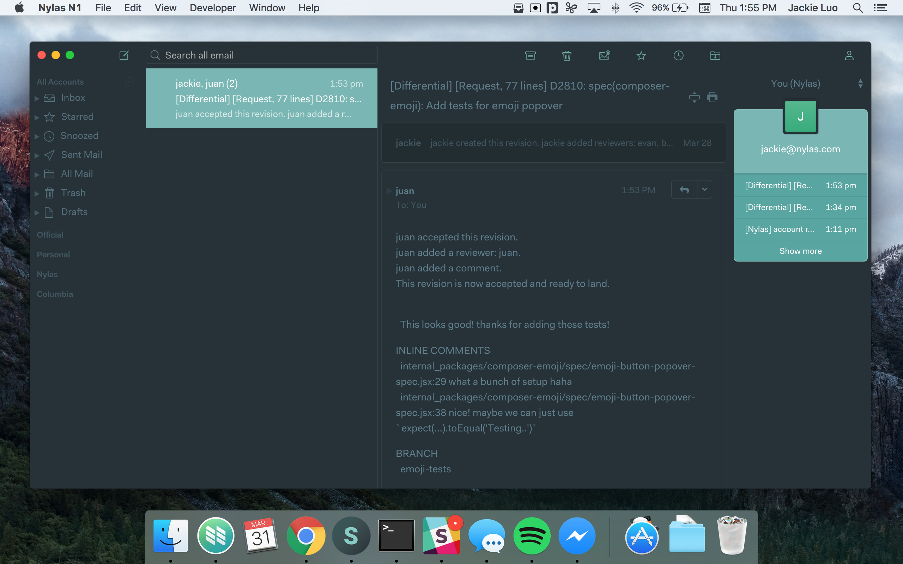

# Material for Mailspring
A theme for Mailspring, inspired by [Material Theme](https://github.com/equinusocio/material-theme) by [equinusocio](https://github.com/equinusocio).

## Installation
1. Download the [Mailspring](https://getmailspring.com/) email client!
2. Download the [latest release](https://github.com/opes/n1-material/releases) of Material.
3. On the Mailspring menu, select `Mailspring > Install Theme...`.
4. Find the directory for this plugin to install it. :tada:
